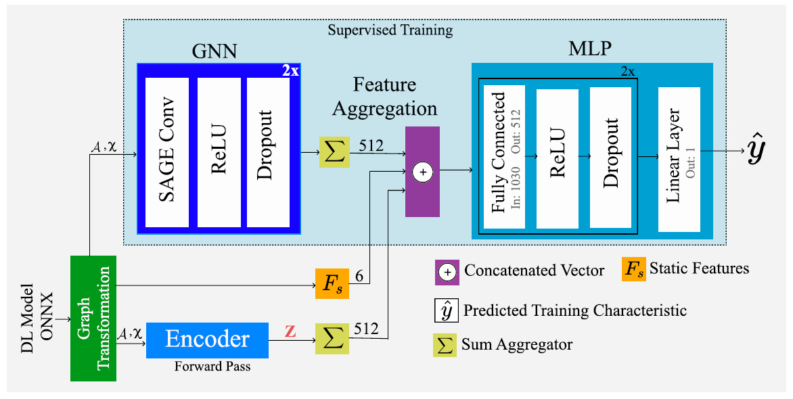
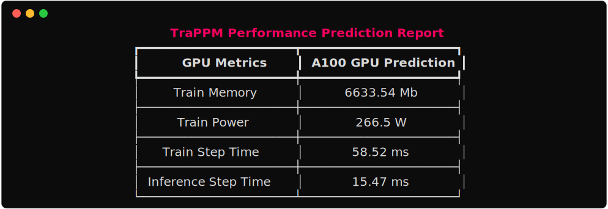

# TraPPM: a Training Characteristics Performance Predictive Model using Semi-supervised Learning

#### Abstract—As the computational demand for deep learning models steadily increases, it has become paramount to accurately predict training characteristics such as training time and memory usage. Predicted values are vital for efficient hardware allocation. Previously, performance prediction tasks have solely relied on supervised approaches. In our work, we harness the strengths of both unsupervised and supervised learning to achieve enhanced accuracy. We introduce TraPPM, a Training characteristics Performance Predictive Model that employs an unsupervised Graph Neural Network (GNN) technique to understand graph representations from unlabeled deep learning models. The learned representation is then integrated with a supervised GNN-based performance regressor to forecast training characteristics.



### TraPPM Usage
```
import trappm

trappm.predict("resnet101_32.onnx")
```



#### To generate onnx, refer to the generate_onnx.py in the example folder


### Environment setup
```

pip install torch==2.0.0 

pip install torch_geometric 

pip install pyg_lib torch_scatter torch_sparse torch_cluster torch_spline_conv -f https://data.pyg.org/whl/torch-2.0.0+cu117.html 

pip install onnx networkx rich
```

### Install TraPPM
```
git clone https://github.com/karthickai/trappm
cd trappm
pip install -e .
```

### Reproducibility
Download and extract dataset [link](https://uniluxembourg-my.sharepoint.com/:u:/g/personal/karthick_pannerselvam_uni_lu/EStmG2f6KE9Bk4HDtkrBYSEBL2QnUXlK76qrmGCrARc7lg?e=ZaiV0d)

Change RESULTS_SAVE_DIR and DATASET_ROOT_DIR in experiments/main.py and UNSUP_DATASET_DIR in experiments/encoder.py
```
cd experiments
```
To train the Graph Auto Encoder
```
python encoder.py 
```
To train the TraPPM

```
python main.py
```

## cite
```
@InProceedings{pannerselvam1,
author="Panner Selvam, Karthick
and Brorsson, Mats",
title="Can Semi-Supervised Learning Improve Prediction of
Deep Learning Model Resource Consumption?",
booktitle="NeurIPS 2023 ML for system workshop",
year="2023",
}
```
